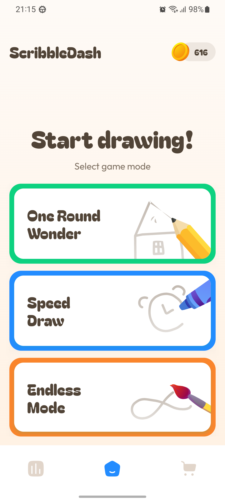
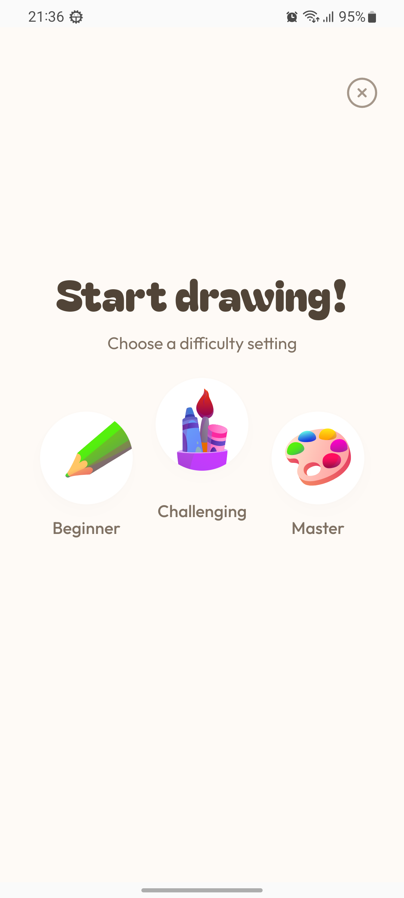
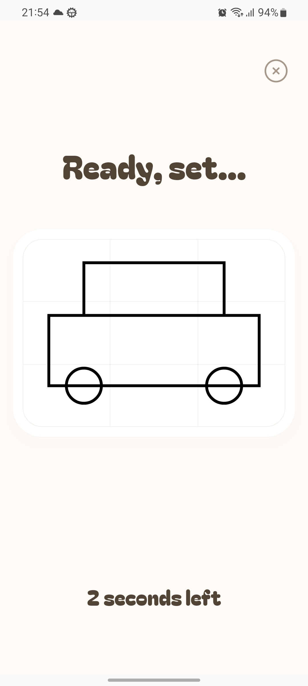
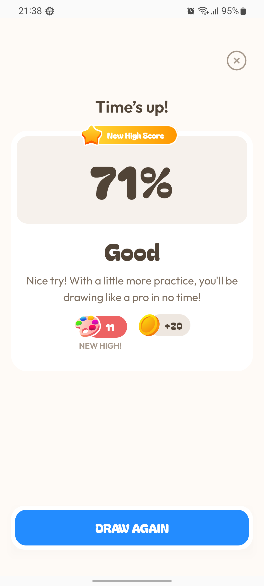
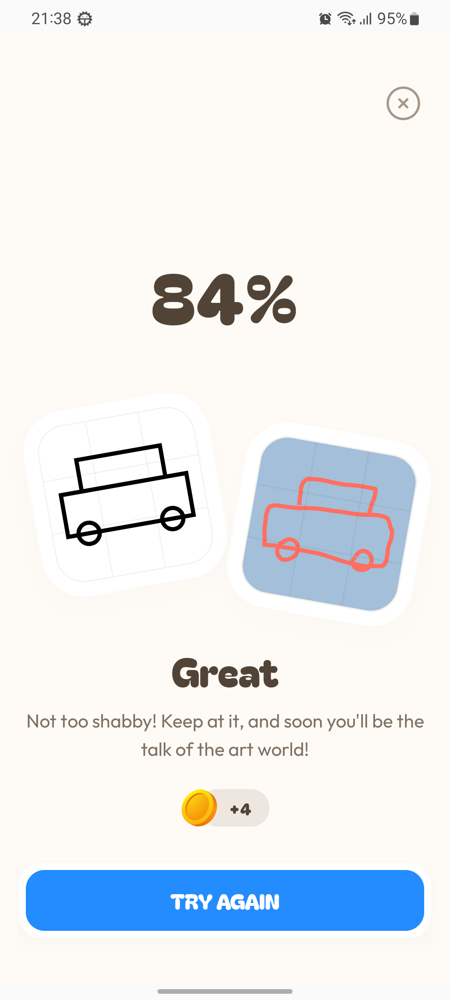
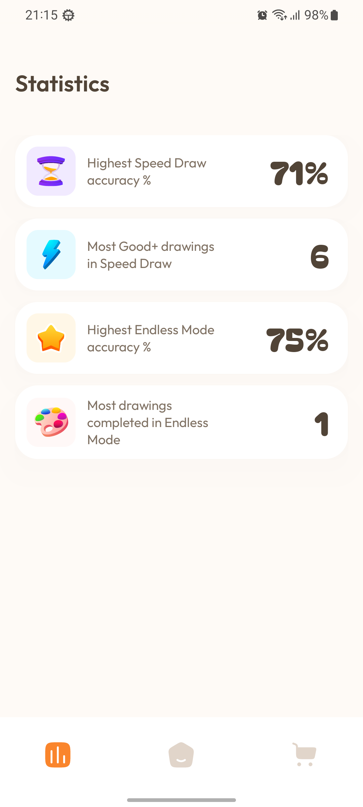
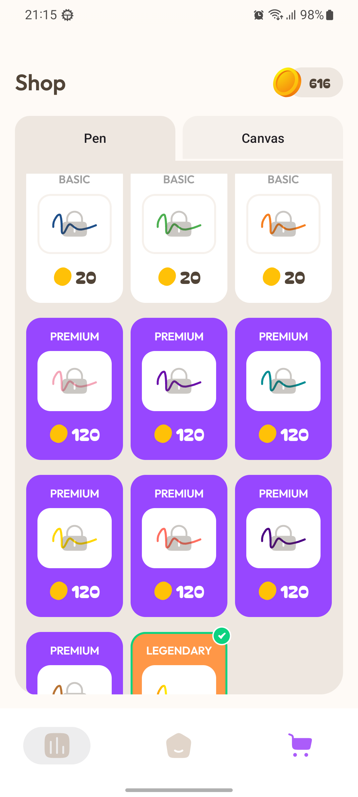
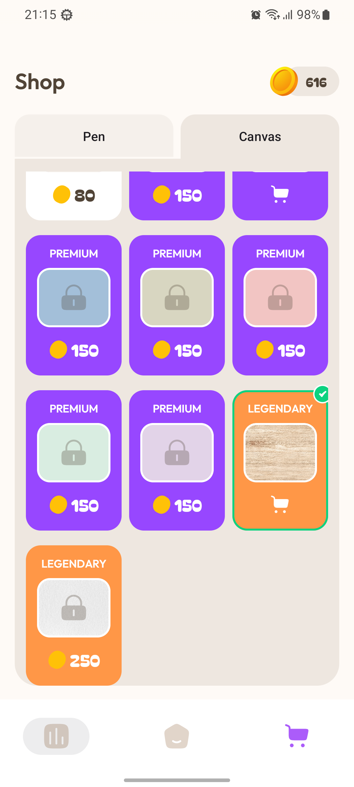

# ScribbleDash

A fast-paced Android drawing game where players redraw AI-generated sketches from memory.

---

## About the Game

**ScribbleDash** is a casual Android game that challenges players to quickly recreate AI-generated drawings from memory. At the start of each round, a reference image is shown for **3 seconds**. Once it disappears, the player must redraw it as accurately as possible based only on memory.

The game combines speed, observation, and creativity, offering multiple game modes and difficulty levels for high replayability.

---

## Screenshots

<p align="center">
  
  
  
  
</p>

<p align="center">
  
  
  
  
</p>

---

## Gameplay Flow

1. An AI-generated drawing is displayed for **3 seconds**
2. The reference image disappears
3. The player redraws the image from memory
4. The result is evaluated based on similarity and performance

---

## Game Modes

* **One Round Wonder**
  A single-round challenge focused on accuracy.

* **Speed Draw**
  Redraw the image as quickly as possible under time pressure.

* **Endless Mode**
  Continuous rounds with increasing difficulty.

---

## Main Screens

* **Home** – Start the game and access all features
* **Difficulty Selection** – Choose the challenge level
* **Gameplay** – Draw and recreate the reference image
* **Statistics** – View scores, progress, and performance
* **Shop** – Unlock items or visual customizations

---

## Features

* AI-generated drawings for unique gameplay
* Memory-based drawing mechanics
* Multiple game modes and difficulty levels
* Clean and intuitive user interface
* Short, fast-paced game sessions

---

## Getting Started

### Prerequisites

* Android Studio
* Android device or emulator

### Installation

```bash
git clone https://github.com/your-username/scribbledash.git
```

1. Open the project in Android Studio
2. Sync Gradle
3. Run the app on an emulator or device

---

## Future Improvements

* Additional drawing styles
* Improved AI evaluation
* Tablet support
* Online leaderboards

---

## Author

Artur Gubała
GitHub: [https://github.com/arturgubala](https://github.com/arturgubala)
